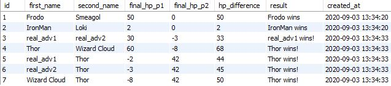

# Adventurer-Classes
A Python project that allows the user to create Adventurer instances of varying types, such as a...
- Fighter
- Wizard 
- Thief

This also allows you to simulate fights between these instances as well as simulate tournaments between several Adventurer instances.

After every single duel the following is stored in SQL database:
- Number of entry
- Names of combatants
- HP's (hit points) of combatants
- The winner of the duel
- The final difference in HP of the duel
- The time and date that the entry was created

**The above image shows the database with several entries. The first two are manually inputted through mySQL while the rest are put in by running the Python code.**
